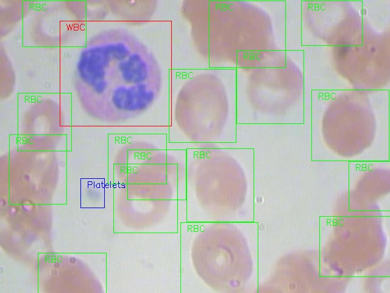

# BCCD Dataset

BCCD Dataset is a small-scale dataset for blood cells detection.

Thanks the original data and annotations from [cosmicad](https://github.com/cosmicad/dataset) and [akshaylamba](https://github.com/akshaylamba/all_CELL_data). The original dataset is re-organized into VOC format. BCCD Dataset is under *[MIT licence](./LICENSE)*.

You can [download](https://github.com/Shenggan/BCCD_Dataset/releases) the `.rec` format for mxnet directly. The `.rec` file can be load by [mxnet.image.ImageDetIter](http://mxnet.incubator.apache.org/api/python/image/image.html?highlight=imagedetiter#mxnet.image.ImageDetIter).

### Data preparation
Data preparation is important to use machine learning. In this project, the Faster R-CNN algorithm from [keras-frcnn](https://github.com/kbardool/keras-frcnn) for Object Detection is used.
From this [dataset](https://github.com/Shenggan/BCCD_Dataset), [nicolaschen1](https://github.com/nicolaschen1) developed two Python scripts to make preparation data (CSV file and images) for recognition of abnormalities in blood cells on medical images.

- export.py: it creates the file "test.csv" with all data needed: filename, class_name, x1,y1,x2,y2.
- plot.py: it plots the boxes for each image and save it in a new directory.

#### Overview of dataset

* You can see a example of the labeled cell image.

  We have three kind of labels :

  * RBC (Red Blood Cell)
  * WBC (White Blood Cell)
  * Platelets (血小板)

  


* The structure of the `BCCD_dataset`

  ```
  ├── BCCD
  │   ├── Annotations
  │   │       └── BloodImage_00XYZ.xml (364 items)
  │   ├── ImageSets       # Contain four Main/*.txt which split the dataset
  │   └── JPEGImages
  │       └── BloodImage_00XYZ.jpg (364 items)
  ├── dataset
  │   └── mxnet           # Some preprocess scripts for mxnet
  ├── scripts
  │   ├── split.py        # A script to generate four .txt in ImageSets
  │   └── visualize.py    # A script to generate labeled img like example.jpg
  ├── example.jpg         # A example labeled img generated by visualize.py
  ├── LICENSE
  └── README.md
  ```

* The  `JPEGImages`:

  * **Image Type** : *jpeg(JPEG)*
  * **Width** x **Height** : *640 x 480*

* The `Annotations` : The VOC format `.xml` for Object Detection, automatically generate by the label tools. Below is an example of `.xml` file.

  ```xml
  <annotation>
  	<folder>JPEGImages</folder>
  	<filename>BloodImage_00000.jpg</filename>
  	<path>/home/pi/detection_dataset/JPEGImages/BloodImage_00000.jpg</path>
  	<source>
  		<database>Unknown</database>
  	</source>
  	<size>
  		<width>640</width>
  		<height>480</height>
  		<depth>3</depth>
  	</size>
  	<segmented>0</segmented>
  	<object>
  		<name>WBC</name>
  		<pose>Unspecified</pose>
  		<truncated>0</truncated>
  		<difficult>0</difficult>
  		<bndbox>
  			<xmin>260</xmin>
  			<ymin>177</ymin>
  			<xmax>491</xmax>
  			<ymax>376</ymax>
  		</bndbox>
  	</object>
      ...
  	<object>
  		...
  	</object>
  </annotation>
  ```


